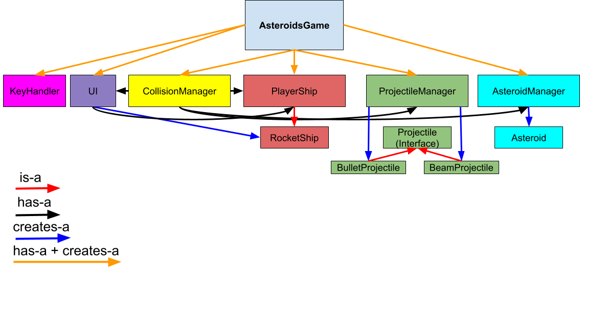

# Asteroids Remake
Created by Kian Naeimi, Sean Sweeney, and Sam Kennedy

## Brief Description
 We recreated the classic arcade game Asteroids with a few changes. The goal of the game is simple: Utilize beams (F Key), bullets (Space-Bar), and physics-based traversal (Up-Key to apply a forward vector, Left/Right keys to change the direction of that vector) 
 to survive endless asteroids.

## System requirements
This game was designed with a standard 1920 by 1080 pixel screen in mind, but feel free to adjust the canvas dimensions to your liking. It's also not graphically intensive by any metric, so if you meet these minimum specifications:
Java: 17/21 installed,
OS: Windows 7 (64-bit) or newer, macOS 10.10 or newer, any mainstream Linux distro,
CPU: Dual core @ 1.6 GHz or newer,
Graphics: Integrated graphics or better,
RAM: ~1 GB for the JVM, 
Storage: 50-100 MB free,

You'll be golden. 

## Running the program
To launch the game, navigate to AsteroidsGame.java and run the main method by hitting the 'Run Java' button in the top right corner of the
IDE. Your movement is handled by the up, left, and right arrow. Press up to go in the direction the tip of the rocket is pointing towards,
and press left/right to change the angle of the forward vector. You will immediately be ambushed by a gang of asteroids... but don't worry-
you have two types of ammo to hold them off:
    
Bullets: Line up the tip of the ship with where you want to fire your bullet(s), and then press space to launch a quick bullet or two. 
        
Beams: Similarly line up your shot, but this time press the F key to fire a beam that spans the entirety of the canvas, taking out any 
asteroids in its way. But be careful- using it stops your movement briefly (and triggers a 2 second cooldown), so you'll have to time your shots out. Hint: If you see a grouping of asteroids, use a beam to quickly dispatch them. 

Asteroids: Each asteroid has effectively three lives: The first is taken when you shoot it in it's first form (which splits the asteroid into two), and the other two lives are taken when you shoot resulting split asteroid. Like the ship, meteors will wrap from one side to the other, so be careful when using the bounds to escape gangs of asteroids- there might be another on the other side spawning in. Only the larger asteroids split- so you can get up close and personal with smaller ones (and maybe stick to long range with larger ones to avoid the randomly displaced split asateroids).
    
Lives: You have 3 lives, represented by the green ship objects on the top left corner of the screen. Each time you lose one, 
a ship will be removed to reflect your failure. Once you lose all 3 available lives, the game ends, and the window will close. Restart
by running the main method in AsteroidsGame again.

Score: Every time you hit a asteroid (of any size), your score will go up by 20. Try to see how high you can get!

## Class Diagram for Reference

    
## Acknowledgements
This program was inspired by two versions of Asteroids: First, the original Atari game (1979, Lyle Rains/Ed Logg). And secondly,
the Adamvision Studios/SneakyBox remake: Asteroids Recharged (2021, Ieva Auželytė).
    
Outside rescources we used: Youtube for movement and key ideas/logic, StackOverflow for bullet/meteor delay ideas.

Preceptors that helped us: Lewis with initial bullet projectile logic/debugging, Marvin with the ConcurrentModificationExceptions we ran into.
    
Help from Professor Bret Jackson with Linear Algebra concepts for beam collision. 
    
This project would be nowhere near where it is now without these people/rescources. All credit goes to them for the progress made in such
a short period of time. 

## Known issues
Currently no restart button functionality- users will have to click play from the IDE again.
There is also no safeguarding against asteroids at the respawn point- so if you lose a life, 
and there's an asteroid at the respawn position, you will lose another life.

## Societal impact
Our game is currently inaccessible to visually-impaired or blind players.
This is because it does not use sound effects and is designed around the player's ability to see what is happening onscreen.
Our game also requires keyboard input, so those unable to press keys will require an accessibility aid to play.

